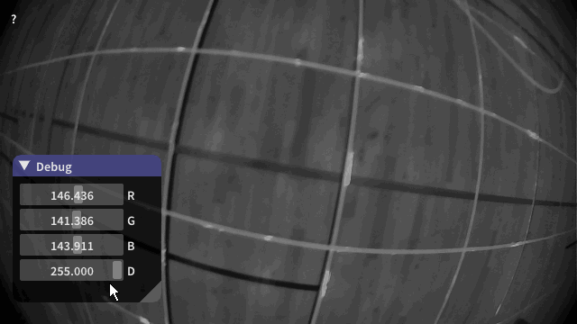
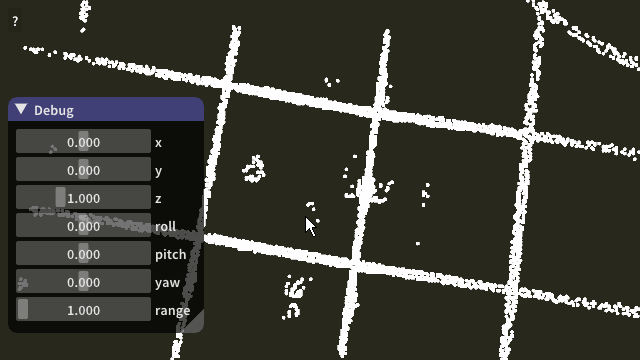
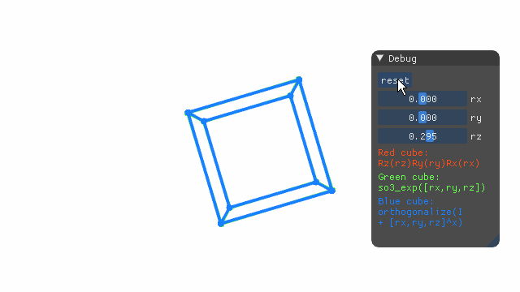
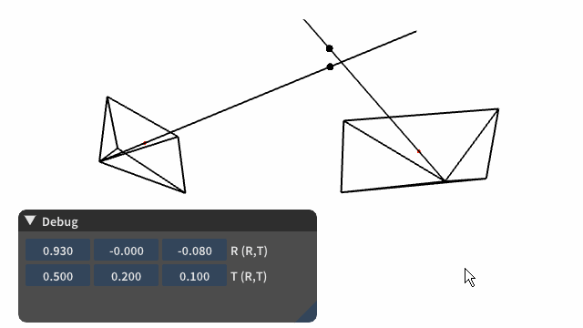
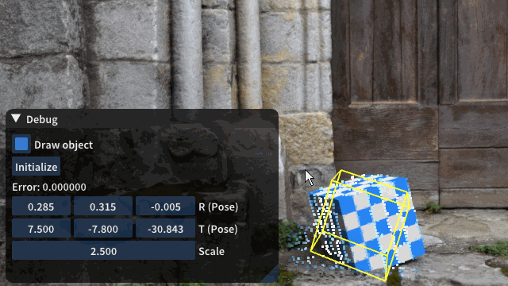

# Examples

## Tweaking parameters of an image processing algorithm


The example below shows a snippet of a program that implements a grid detection algorithm. Leading up to the code shown, the program has loaded an image from disk and decoded it into an RGB pixel array ```rgb```.

The first step of the algorithm is to pre-process the image by applying a color filter. To see and modify the results from this first step, before moving on to the next steps of the algorithm, I placed a VDB block right after the image has been decoded.

This means means that the program will run normally until it decodes the image, then it will stop to open a graphical window that runs our interactive visualization code repeatedly, until we decide to move on (by pressing the built-in Continue button).

```
// external variables
unsigned char *rgb;
float r, g, b, d;
// ...
VDBB("Threshold");
{
    threshold(rgb, gray, width, height, r, g, b, d);
    vdbSetTexture2D(0, gray, width, height, GL_LUMINANCE);
    vdbDrawTexture2D(0);
    SliderFloat("R", &r, 0, 255);
    SliderFloat("G", &g, 0, 255);
    SliderFloat("B", &b, 0, 255);
    SliderFloat("D", &d, 0, 255);
}
VDBE();
// ... rest of program
```

## Mixing custom OpenGL drawing with ImGUI


Here I'm checking the results from another part of the grid detection algorithm, that identifies edges and boundary pixels in the image.

I use OpenGL to draw the ten thousands of points extracted from line boundaries, and I use a couple of sliders to make small adjustments to the estimated camera rotation until the grid appears straight.

```
// external variables
float cam_rotation[3]; // roll, pitch, yaw angles
float cam_position[3]; // x, y, z position
// ...
VDBB("World features");
{
    static float range = 1.0f;

    // Adjust the coordinate space in which we draw the points,
    // so that the bottom and top window edges map to -+range and
    // the left and right window edges map to -+range * AspectRatio.
    vdbOrtho(-range*vdbAspect(), +range*vdbAspect(), -range, +range);

    glPoints(4.0f); // Start drawing points with 4-pixel radius
    glColor4f(1.0f, 1.0f, 1.0f, 1.0f); // Set current color to white
    for (int i = 0; i < num_edge_pixels; i++)
    {
        vec2 pixel = edge_pixels[i];
        vec2 point = inverse_project(pixel, cam_rotation, cam_position);
        glVertex2f(point.x, point.y); // Draw the point
    }
    glEnd(); // Stop drawing points

    SliderFloat("x",     &camera_x, -1.0f, +1.0f);
    SliderFloat("y",     &camera_y, -1.0f, +1.0f);
    SliderFloat("z",     &camera_z, +0.1f, +3.0f);
    SliderFloat("roll",  &camera_ex, -0.4f, +0.4f);
    SliderFloat("pitch", &camera_ey, -0.4f, +0.4f);
    SliderFloat("yaw",   &camera_ez, -0.4f, +0.4f);
    SliderFloat("range", &range, 1.0f, 20.0f);

}
VDBE();
```

## Conditional visualizations and tooltips


Here I check the results from the line extraction step. Each hypothesized line is drawn as a blue/white dot. If I hover over one of these, the code draws a tooltip with information for that specific line, such as which index it has, how many pixels voted for the line, and the line parameters (angle and distance from origin). I also draw the hovered line in red on top of the pixels (in dark).

The source code for this one is a bit more involved and uses a function called ```vdbMap```. It takes in an X and Y coordinate and returns true if your mouse was closest to this coordinate, out of all other calls to vdbMap over one frame. A common use pattern is as shown here, where you draw a bunch of items per frame, and want to find out which, out of all the items, your mouse was closest to, in order to do some specific draw code.

```
VDBB("Potential lines");
{
    vdbClear(0.16f, 0.16f, 0.1f, 1.0f);

    // Draw edge pixels
    vdbOrtho(0.0f, width, height, 0.0f);
    glPoints(4.0f);
    glColor4f(0.1f, 0.1f, 0.1f, 1.0f);
    for (int i = 0; i < num_edges; i++)
        glVertex2f(edges[i].x, edges[i].y);
    glEnd();

    // Remember which line we hover over for later...
    float hover_angle = 0.0f;
    float hover_distance = 0.0f;

    // Draw line hypotheses as dots with color intensity
    // based on number of votes
    vdbOrtho(angle_min, angle_max, distance_min, distance_max);
    glPoints(8.0f);
    for (int i = 0; i < num_lines; i++)
    {
        float angle    = lines[i].angle;
        float distance = lines[i].distance;
        int votes      = lines[i].votes;

        // Check if we are hovering over this dot
        if (vdbMap(angle, distance))
        {
            hover_angle = angle;
            hover_distance = distance;
            SetTooltip("%d %d\n%.2f %.2f", i, votes, angle, distance);
            glColor4f(1.0f, 1.0f, 0.2f, 1.0f);
        }
        else
        {
            vdbColorRamp(votes / (float)max_votes);
        }

        // Draw the dot
        glVertex2f(angle, distance);
    }
    glEnd();

    // Draw the hovered-over line in red
    vdbOrtho(0.0f, width, height, 0.0f);
    float x1, y1, x2, y2;
    get_line_endpoints(hover_angle, hover_distance, &x1, &y1, &x2, &y2);
    glLines(4.0f);
    glColor4f(1.0f, 0.2f, 0.2f, 1.0f);
    glVertex2f(x1, y1);
    glVertex2f(x2, y2);
    glEnd();
}
VDBE();
```

## More examples


A quick camera calibration tool that lets me manually select intersection points on a checkerboard and generate MATLAB code that can be copied as text.


A prototype for a flight-path drawing tool.


Drawing the results from a grid detection algorithm on top of the original input, and adjusting the estimated camera rotation and translation to make the grid fit better.



Comparing the difference between three methods of computing 3D rotations.



Trying to compute the closest intersection between two lines in 3D.


Looking at the results from a structure-from-motion algorithm, looking at both the views that were used to triangulate the 3D points, and the resulting 3D point cloud.



Trying to fit a 3D box to a 3D scene reconstruction. The highlighted dots are points whose original 3D coordinates are known.
