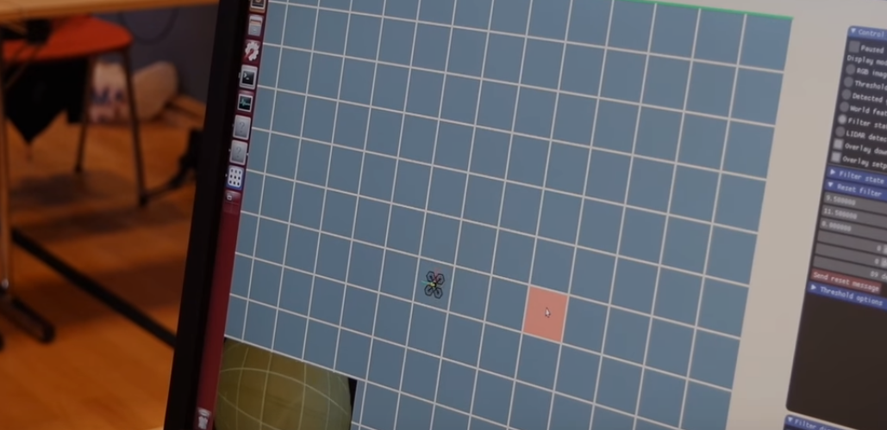

# VDB




## What is this?
**VDB** is a C++ library that lets you to add interactive visualizations to your code: e.g. visualize real-time sensor data, see step-by-step algorithm results, or tweak the parameters of an image processing algorithm and see the results change live. You can also use it to prototype full GUI applications.

## What does it do?
The library simplifies the tedious process of opening an OpenGL graphics window, and also includes the [Dear ImGui](https://github.com/ocornut/imgui/) library. For example, here is a complete program that opens a graphics window, and lets you change the background color with a slider widget:

```c++
#include <vdb.h>
int main(int, char**)
{
    float color[3] = { 1.0f, 1.0f, 1.0f };
    VDBB("Test window");
    {
        vdbClear(color[0], color[1], color[2], 1.0f);
        SliderFloat3("Color", color, 0.0f, 1.0f);
    }
    VDBE();
    return 0;
}
```

## How do I use it?
For a quick start, try to compile and run [test.cpp](test.cpp). This is a self-contained program that uses the library to show off basic usage patterns. Compile the program by following the instructions for your platform, written in the comment section at the top of the file.

Once you are able to compile and run this program you should be good to go integrate the library into your own project! Here are some tips to get you further:

* Learn more about using ImGui and its features by visiting its [project page](https://github.com/ocornut/imgui/), or by reading its documentation found at the top of the [imgui.h](src/imgui.h) header file.

* Look at screenshots and videos of the library in action in the [gallery](gallery.md).

* See [example_cmake](example_cmake) for how to integrate the library into a CMake-based project.

* See [example_ros](example_ros) for an example of using the library with ROS, to visualize the results of a node and adjusting its run-time parameters live.
